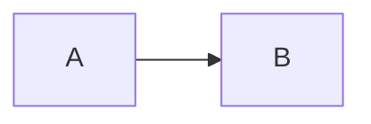

For apps that support markdown (e.g. [GitHub](https://docs.github.com/en/get-started/writing-on-github/working-with-advanced-formatting/creating-diagrams) and [GitLab](https://handbook.gitlab.com/handbook/tools-and-tips/mermaid/)), you can add Mermaid diagrams by making a `mermaid` code block.

The following code-block will be rendered as a Mermaid diagram:

---
> Write a mermaid code block for the given context from the note.

---
